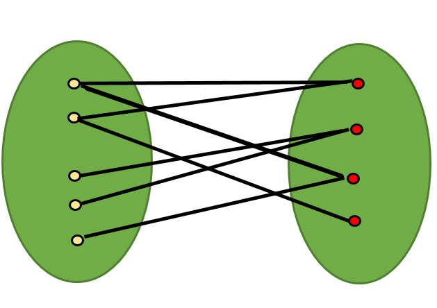

<!DOCTYPE html>
<html>
<head>
</head>

<body>
    <h1>Introduction to Graph</h1>
    <ul>
        <li>A Graph is a collection of <b>nodes or vertices</b> with edges between some of the vertices.</li>
        <li>All Trees are graphs.In a tree:</li>
        <ul>
            <li>All nodes must be connected whereas a graph can have unconnected nodes as well</li>
            <li>There is only one path between any two nodes </li>
            <li>There is no cycle </li>
            <li>The edges are not directed </li> 
        </ul>
        <li>Graphs are used to represent things that can connect to each other</li>
        <ul>
            <li>Houses and roads</li>
            <li>People and their family members </li>
            <li>Computers and their connections in a network</li>
        </ul>
    </ul>
    <h2>Types of graph</h2>
    <ul>
        <li>Cyclic and Acyclic</li>
        <li>Connected and Not Connected</li>
        <li>Directed and Undirected</li>
        <li>Weighted and Unweighted</li>
    </ul>
    <h2>Graph Representation</h2>
    

        <h3>Edge List</h3>
        
Shows list of edges in the graph as follows - int[][]graph = {{1,2},{2,3},{2,4},{3,4}} 
        Disadvantage is that this may not show all the nodes in the graph

        <h3>Adjacency List</h3>
        
Each node has entries with the entries representing the nodes it is connected to 
        int [][]graph = {{2},{1,3,4},{2,4},{2,3}}

        <h3>Adjacency Matrix</h3>
        
Each row and column combination represents Vertices between 2 Nodes. 
            1 indicates connection, 0 indicates no connection 
        int graph[][] = {{0,1,0,0},
                         {1,0,1,1}       
                         {0,1,0,1}
                         {0,1,1,0}}
        

        <i><b>Time and Space complexity:</b>O(N+V),for Adjacency list traversal </i>
        <i><b>Time and Space complexity:</b>O(N^2),for Adjacency Matrxi traversal</i>
        <h2>Graph Traversal</h2>
        <ul>
            <li><b>BFS:</b>
            <ul>
                <li>BFS will find the shortest path between the 2 points.</li>
                <li>DFS doesn't necessarily find the shortest path</li>
            </ul>
            </li>
            <li><b>DFS</b>
            <ul>
                <li>DFS is easier to implement - recursively.</li>
                <li>DFS on a (balanced) binary tree would take less memory than BFS</li>
            </ul>
            </li>
        </ul>
        <h2>Bipartite Graph</h2>
        
A bipartite graph is a graph whose <b>vertices can be divided into two disjoint sets</b> U and V such that <b>no two vertices within the same set have an edge</b> between them.
        

        
   

</body>

</html>