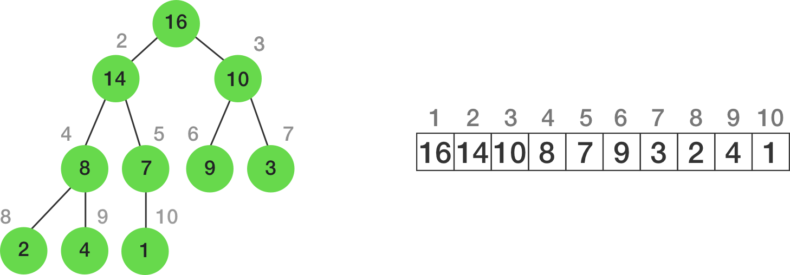

<h2>1-Prefix Sum</h2>
<h4>What is Prefix Sum?</h4>

<ul>
    <li>For every element arr[i], we generate the <b>sum of all elements from 0 to i.</b> We store these values and it is useful in solving such problems.</li>
    <li>This sum calculation is done in O(n) time by doing (current_sum = previous_sum + arr[i]).</li>
</ul>

<h2>How is Prefix Sum useful in solving the above problem(subarraySumZero)</h2>

    <ul>
        <li>If the Prefix Sum for any index in the array has been seen before or if the Prefix Sum is zero, we have a zero sum sub-array.</li>
        <li>Example 1: Array[5,3,-1,-1,-1,8]
            <ul>
                <li>Prefix Sum array[<b>5</b>,8,7,6,<b>5</b>,13]</li>
                <li>We see that 5 is seen before. This tells us that the sub-array[3,-1,-1,-1] is a subarray of sum 0.</li>
            </ul>
        </li>
        <li>Example 2: Array[-1,2,4,-3,-2,7]
            <ul>
                <li>Prefix Sum array[-1,1,5,2,<b>0</b>,7]</li>
                <li>We see a prefix sum of 0. this tells us that the preceding subarray[-1,2,4,-3,-2] sums to 0.</li>
            </ul>
        </li>
    </ul>

<h2>2-Heap Data Structure</h2>
<ul>
    <li>Heaps are the data structure that can <b>access the maximum or minimum element very quickly.</b> </li>
    <li>They are <b>implemented using arrays</b> (can also use linked list). the <b>Array Map</b> of Heap would like this </li>
</ul>
    

